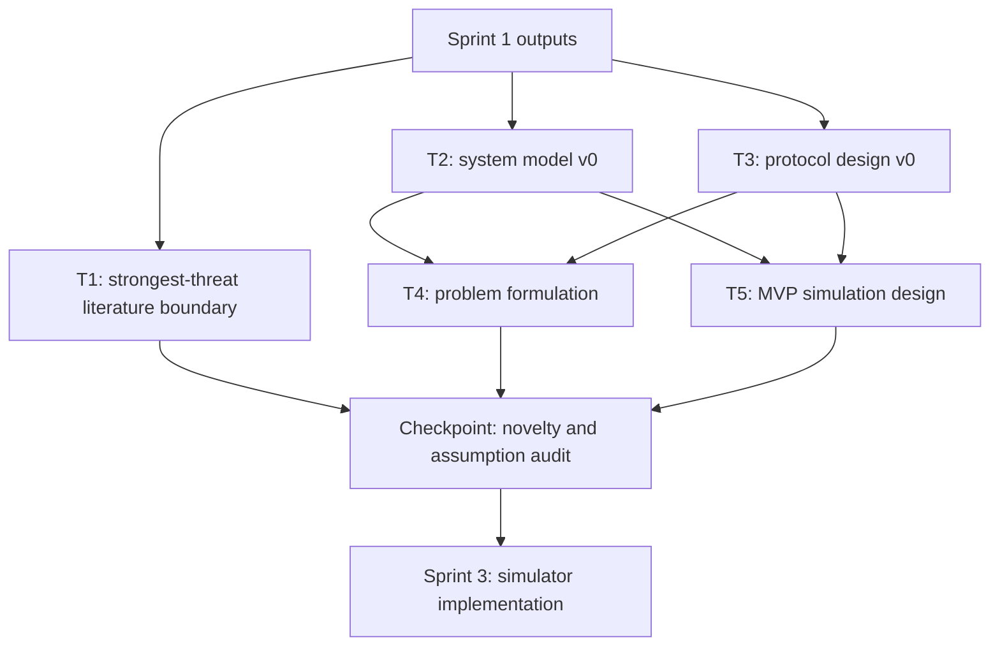

# Sprint 2 任务拆解：模型、协议与最小仿真闭环

## 目标

把 Sprint 1 的研究问题从“可做性判断”推进到“可仿真的模型和协议”。Sprint 2 不追求完整论文，也不急于大规模实验；重点是形成一个严格、不偷用先验信息、可被代码实现的最小闭环。

## 当前输入

- `01_research_question/研究问题brief.md`
- `01_research_question/创新点假设.md`
- `01_research_question/可做性与风险.md`
- `02_literature/why_how_what.md`
- `02_literature/gap_analysis.md`

## 输出产物

| 产物 | 路径 | 目的 |
|---|---|---|
| 系统模型 | `03_model/system_model.md` | 定义网络、波束、时隙、ISAC 观测、发现和拓扑状态 |
| 符号表 | `03_model/symbol_table.md` | 统一后续公式、伪代码和仿真变量 |
| 问题形式化 | `03_model/problem_formulation.md` | 明确优化目标、约束和评价指标 |
| 协议设计 | `04_protocol/protocol_design.md` | 给出 ISAC 辅助拓扑感知概率式邻居发现机制 |
| 伪代码 | `04_protocol/pseudocode.md` | 将协议转为可实现流程 |
| 实验计划 | `05_simulation/run_experiments.md` | 定义 MVP 实验、基线、参数扫描和输出格式 |
| MVP 配置 | `05_simulation/configs/mvp.yaml` | 第一版可复现实验配置 |

## 并行任务图

## 任务清单

### T1. 最强威胁文献边界复核

并行性：可并行。

目标：

- 复核 SkyOrbs 2024、ISAC-assisted beam rendezvous 2024、CommRad 2024、NR-V2X sensing-assisted protocol 2024、adaptive beam probing 2026。
- 判断是否已有工作同时覆盖 fully distributed U2U、pre-alignment ND、ISAC/sensing prior、randomized discovery protocol、topology-aware objective。

产物：

- 更新 `02_literature/gap_analysis.md`。
- 若发现重叠严重，更新 `01_research_question/可做性与风险.md`。

退出条件：

- 能用一张表说明本研究与最强 5 篇威胁文献的差异。

### T2. 系统模型 v0

并行性：可与 T1、T3 并行，但 T4/T5 依赖它。

目标：

- 定义完全分布式 UAV-UAV 网络。
- 定义本地波位坐标、三维 beam cell、时隙和节点模式。
- 定义 ISAC observation，而不是 oracle neighbor position。
- 定义双向邻居发现成功条件。
- 定义拓扑质量状态和可用/不可用信息边界。

产物：

- `03_model/system_model.md`
- `03_model/symbol_table.md`

退出条件：

- 协议输入输出均可由模型变量表示。
- 未使用对准前不可获得的信息。

### T3. 协议设计 v0

并行性：可与 T1、T2 并行，但需要承接 T2 的变量。

目标：

- 设计 ISAC-Assisted Topology-Aware Probabilistic Neighbor Discovery。
- 明确 sensing / Tx / Rx 模式选择。
- 明确 beam-cell probability 如何更新。
- 明确 topology-aware priority 如何在本地计算。
- 明确虚警、漏检和过期感知如何处理。

产物：

- `04_protocol/protocol_design.md`
- `04_protocol/pseudocode.md`

退出条件：

- 至少有主算法、ISAC-only 消融版、topology-blind 消融版和 oracle 上界。

### T4. 问题形式化

并行性：依赖 T2/T3 的初稿。

目标：

- 定义目标函数：发现效率 + 拓扑收益。
- 定义约束：完全分布式、本地信息、模式互斥、探索下界。
- 定义评价指标：平均时延、尾部时延、空扫、连通性、收敛速度。

产物：

- `03_model/problem_formulation.md`

退出条件：

- 目标函数能映射到仿真统计。

### T5. 最小仿真闭环设计

并行性：依赖 T2/T3 的初稿，可与 T4 并行细化。

目标：

- 设计离散 beam-cell 级仿真。
- 明确基线、参数扫描和随机种子。
- 定义原始结果文件和图表输出。

产物：

- `05_simulation/run_experiments.md`
- `05_simulation/configs/mvp.yaml`

退出条件：

- Sprint 3 可以直接据此写仿真代码。

## 执行顺序

1. 本轮先完成 T2/T3/T4/T5 的 v0 文档。
2. 并行智能体返回后，合并 T1、模型压力测试和实验设计建议。
3. 提交并推送 Sprint 2 v0。
4. 下一轮进入 Sprint 3：最小仿真器实现。

## Checkpoint

进入 Sprint 3 前必须回答：

1. 协议有没有使用真实邻居位置或全局拓扑？
2. ISAC observation 是否与真实邻居状态严格分离？
3. topology-aware priority 是否可由本地状态计算？
4. 虚警/漏检是否会导致永久不可发现？如果不会，机制是什么？
5. 所有 baseline 是否能在同一时隙和波束模型下公平比较？
