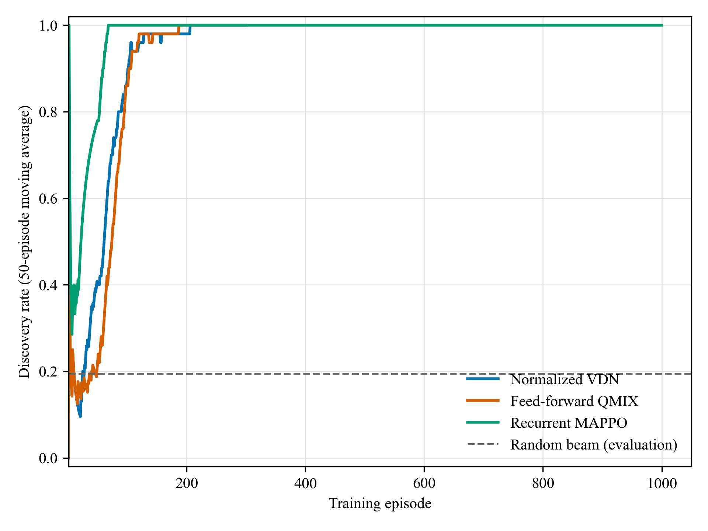

# Two-node optimizer sanity gate (2026-07-12)

## Purpose and scope

This experiment isolates the optimization question from the full neighbor-discovery problem. It is a diagnostic gate, not a paper-level performance result.

- Two static UAVs, planar 8-beam codebook (45 degrees), 16 slots per episode.
- Ideal communication PHY, no ISAC observations, and all eight beams initially valid.
- Node 0 is fixed to TX and node 1 to RX. Only the beam is learned.
- The topology is fixed during training and evaluation; full discovery terminates the episode.
- The deterministic complementary role pattern is explicitly marked `sanity_only` and is not part of the proposed deployable protocol.

The matched random-beam control has a theoretical finite-horizon discovery probability
`1-(1-1/64)^16 = 22.3%`; 200 Monte Carlo episodes produced 19.5%.

## Root cause found

Before the fix, every beam had identical input features when no ISAC evidence was available. The actor and Q networks had no beam-center direction encoding, so they were permutation-equivariant across absolute beam indices. After 1000 episodes:

- normalized VDN produced eight equal Q values near -0.024;
- feed-forward QMIX produced eight equal Q values near 0.055;
- both greedy policies selected beam 0 by tie breaking and achieved 0% discovery;
- the random-beam control achieved 19.5%.

The true reciprocal beams in the fixed scenario were beam 7 and beam 3. The network could not represent this mapping, regardless of training duration.

The fix appends the body-frame unit vector of every beam-cell center to its local beam token. This is a physical, scale-compatible action representation, not a target-derived recommendation or oracle label.

## Corrected gate results

| Method | Training episodes | Deterministic discovery rate | Mean delay (slots) | Random control |
|---|---:|---:|---:|---:|
| Normalized VDN | 300 | 100% | 1.00 | 19.5% |
| Feed-forward QMIX | 300 | 100% | 2.00 | 19.5% |
| Recurrent MAPPO | 1000 | 100% | 1.00 | 19.5% |

For recurrent MAPPO, the rolling training discovery rate was 89% in episodes 1-100 and 100% thereafter. Mean training delay decreased from 4.72 slots in episodes 1-100 to 1.23 slots in episodes 601-1000.

## Structural prototype

The recurrent actor now supports `role_factorization=beam_conditioned`, implementing

`pi(beam, role | o) = pi(beam | o) pi(role | selected_beam, o)`.

The conditional role tower reads only local aggregate observations and per-beam local features, including the beam-center direction. It has parameters disjoint from the recurrent beam tower. PPO replay gathers the role log probability at the actually selected beam. Joint entropy is computed as beam entropy plus the beam-probability-weighted conditional role entropy, and the role-balance statistic uses the marginal TX probability.

## Interpretation and next gate

This gate establishes that all three optimizer families can learn the elementary beam action once the action representation is identifiable. It does not establish algorithm superiority, generalization, ISAC benefit, learned role coordination, or N=10 performance.

The next causal gate should keep the same two-node environment but restore learned TX/RX roles and compare independent versus beam-conditioned role factorization. Only after the conditional model reliably exceeds independent factorization should ISAC residual observations be enabled, followed by varying topology and N=10 experiments.

Raw result directories:

- `05_simulation/results_raw/sanity_n2_vdn_direction_300_20260712`
- `05_simulation/results_raw/sanity_n2_qmix_direction_300_20260712`
- `05_simulation/results_raw/sanity_n2_rmappo_direction_1000_20260712`
